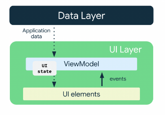
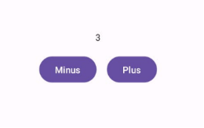



# MVVM Architecture
 

**

## Introduction

*App architecture* is a set of design rules for an app. Much like the blueprint of a house, your architecture provides the structure for your app.

**Advantages of clean architecture:**

A well-designed app architecture helps you scale your app and extend it with additional features. Architecture can also simplify team collaboration.

  

The most common architectural principles are:

  

1.  **Separation of concerns**: The separation of concerns design principle states that the app is divided into classes of functions, each with separate responsibilities.

1.  **Drive UI from a model**: The drive UI from a model principle states that you should drive your UI from a model. Models are components responsible for handling the data for an app. They're independent from the UI elements and app components in your app, so they're unaffected by the app's lifecycle and associated concerns.

**Recommended app architecture**

  

Considering the above-mentioned architectural principles, each app should have at least two layers:

  

-  **UI layer:** a layer that displays the app data on the screen but is independent of the data.

-  **Data layer:** a layer that stores, retrieves, and exposes the app data.

  

You can add another layer, called the domain layer, to simplify and reuse the interactions between the UI and data layers. This layer is optional.

  

The UI layer is made up of the following components:

  

-  **UI elements:** Components that render the data on the screen. You build these elements using Jetpack Compose.

-  **State holders:** Components that hold the data, expose it to the UI, and handle the app logic. An example state holder is ViewModel.

  
  

*UI is a result of binding UI elements on the screen with the UI state. We create the UI elements using Compose and store all the UI States in State Holder (ViewModel).*

  

  

**ViewModel:**

  
  

` `ViewModel is one of the architecture components from Android Jetpack libraries that can store your app data.

To implement ViewModel in your app, extend the ViewModel class, which comes from the architecture components library and stores app data within that class.

  

**Advantages**:

  

1. The stored data is not lost if the framework destroys and recreates the activities during a configuration change or other events. However, the data is lost if the activity is destroyed because of process death. The ViewModel only caches data through quick activity recreations.

  

1. ViewModel separates an app's user interface from its logic, reducing the coupling between UI and business rules.

  
  
  

###

**Example Implementation:**

  

Here’s an example of how ViewModel is implemented. We’ll create a basic app using MVVM guidelines. The app will contain a screen containing two buttons which will decrement and increment a value on the screen.

  

	class MyViewModel : ViewModel() {  
	  
		private val _counter = MutableStateFlow<Int>(0)  
		val counter = _counter.asStateFlow()  
	  
		private fun increment() {  
			_counter.value++  
		}  
	  
		private fun decrement() {  
			_counter.value--  
		}  
	  
	  
		fun uiListener(event: CounterEvent) {  
			when (event) {  
				is CounterEvent.Increment -> increment()  
				is CounterEvent.Decrement -> decrement()  
			}  
		}  
	}

  

**ViewModel**: MyViewModel class extends ViewModel, which is part of Android's Jetpack architecture components. It holds data related to the UI and survives configuration changes.

**State Management**: \_counter is a MutableStateFlow, which is a type of Flow from Kotlin Coroutines that represents a state with a single mutable value. counter exposes this state as an immutable StateFlow, which emits updates to the UI whenever \_counter changes.

**Business Logic**: increment() and decrement() methods modify \_counter based on the user's actions (incrementing or decrementing).

**Event Handling**: uiListener(event: CounterEvent) is a method that receives events (CounterEvent) from the UI. It invokes increment() or decrement() based on the event type.

	sealed class CounterEvent {  
		data object Increment : CounterEvent()  
		data object Decrement : CounterEvent()  
	}

  

**Sealed Class (CounterEvent):** Defines a set of events that can be handled by MyViewModel. Increment and Decrement are singleton objects representing specific actions (incrementing and decrementing the counter).

	class MainActivity : ComponentActivity() {  
		override fun onCreate(savedInstanceState: Bundle?) {  
			super.onCreate(savedInstanceState)  
			setContent {  
				val viewModel: MyViewModel by viewModels()  
	  
				PlusMinus(  
					counter = viewModel.counter.collectAsState().value,  
					uiListener = viewModel::uiListener  
				)  
			}  
		}  
	}  
	  
	@Composable  
	fun PlusMinus(counter: Int, uiListener: (CounterEvent) -> Unit) {  
		Surface {  
			Column(  
				modifier = Modifier  
					.fillMaxSize()  
					.padding(16.dp),  
				verticalArrangement = Arrangement.Center,  
				horizontalAlignment = Alignment.CenterHorizontally  
			) {  
				Text(text = "$counter")  
	  
				Spacer(modifier = Modifier.height(16.dp))  
	  
				Row(  
					horizontalArrangement = Arrangement.Center,  
					verticalAlignment = Alignment.CenterVertically  
				) {  
				Button(onClick = { uiListener(CounterEvent.Decrement) }) {  
					Text(text = "Minus")  
				}  
	  
				Spacer(modifier = Modifier.width(16.dp))  
	  
				Button(onClick = { uiListener(CounterEvent.Increment) }) {  
					Text(text = "Plus")  
					}  
				}  
			}  
		}  
	}
  

**Activity (MainActivity**): It initializes MyViewModel using viewModels() delegate from androidx.activity.viewModels.

**State Management**: viewModel.counter.collectAsState().value collects updates from counter as a Composable state. It ensures that whenever counter in MyViewModel changes, the UI automatically recomposes.

**Event Propagation**: uiListener is passed down to PlusMinus Composable, allowing it to send events (CounterEvent.Increment or CounterEvent.Decrement) back to MyViewModel.

  
  

**Flow of Data in MVVM**

  

The flow of data in MVVM is a key principle that keeps an application organized and maintainable. A button click, for instance, triggers an event in the View layer, which is then passed onto the ViewModel. The ViewModel processes this event and updates the Model accordingly. The Model then handles data persistence and business logic, resulting in a circular data flow that keeps the user interface updated. This pattern effectively hides the business and validation logic from the View layer, ensuring a clean separation of concerns.

  

**Related Questions:**

  

1. Question: What is the difference between Clean Architecture and MVVM?

Answer: Clean Architecture and MVVM are different architectural patterns. Clean Architecture separates the whole app into UI layer, Data layer and the Domain layer. While MVVM separates the user interface (View) from the business logic and data handling (Model and ViewModel). An app can use both architectures simultaneously. The diagram below makes it clearer.

  

  

2. Question: How does StateFlow help in managing state within a ViewModel?

Answer: StateFlow, used in the ViewModel example, allows for observing state changes asynchronously. It ensures that the UI is updated reactively when the state changes, maintaining a responsive user experience in Jetpack Compose applications.

  

3. Question: Is Flow mandatory when using Jetpack Compose?

Answer: Flow is not mandatory, but it is recommended for handling asynchronous state updates efficiently. Alternatives like LiveData can still be used with Compose, but Flow's integration with Kotlin coroutines provides seamless asynchronous operations that align well with Compose's reactive UI model. In short, Flow is a more modern approach than LiveData.

  

4. Question: What is the difference between MutableStateFlow and StateFlow, and why use one over the other?

Answer: MutableStateFlow is mutable and allows modifying its value, suitable for ViewModel internals. StateFlow, on the other hand, is read-only and exposes its value as immutable to external components, ensuring data consistency and thread safety.

  

5. Question: Why are ViewModel properties and methods marked as private?

  

Answer: In ViewModel design, marking properties and methods as private encapsulates internal implementation details. This encapsulation ensures that external components cannot directly modify or access these internals, adhering to the principles of encapsulation and information hiding. It also helps maintain the integrity of the ViewModel's state and behavior, reducing the risk of unintended side effects or bugs caused by external interference.

  

6. Question: What is the benefit of using immutable StateFlow in ViewModel?

Answer: Immutable StateFlow ensures that the exposed state is read-only and can only be updated internally within the ViewModel. This approach guarantees thread safety and prevents unintended modifications from external components, maintaining data consistency and integrity. By exposing an immutable view of state through StateFlow, ViewModel provides a controlled and reliable way for UI components (such as Jetpack Compose) to observe and react to state changes without modifying the underlying data directly.

  

7. Question: What are the benefits of using sealed classes in Kotlin?

Answer: These are the reasons why we use sealed classes:

	1.  **Exhaustive When Expressions**: When you use a when expression with a sealed class, the compiler can check if all possible cases are covered. This is particularly useful in ensuring that all events or states are handled, reducing the risk of runtime errors.

	2.  **Type Safety:** Sealed classes enforce type safety by restricting the subclasses that can be created. This makes your code more predictable and easier to understand.

	3.  **Simplified Code**: By grouping related types together, sealed classes can simplify your code, making it more readable and maintainable.

  8. Question: Why use ViewModel when we can use rememberSaveable?

Answer: Most of the time, you can use rememberSaveable but that might mean keeping the logic in or near composables. When apps grow, you should move data and logic away from composables. Therefore, we use ViewModels, which not only preserves state on configuration changes, but is also used for separation of concerns.

  
  

**Related Videos and Documentations**

  

1. Kotlin Flows: <https://youtu.be/fSB6_KE95bU?si=LgS3TGbw9JOGKj0n>

1. App Architecture: <https://youtu.be/AfCzIEwt_i4>

1. UI Layer: <https://youtu.be/p9VR8KbmzEE>

1. ViewModel:

	a) <https://www.youtube.com/watch?v=9sqvBydNJSg>

	b) <https://developer.android.com/codelabs/basic-android-kotlin-compose-viewmodel-and-state#0>

1. MVVM: <https://www.youtube.com/watch?v=-xTqfilaYow>

1. MVVM vs Clean Architecture: <https://www.youtube.com/shorts/ZL8QZdo4bPY>